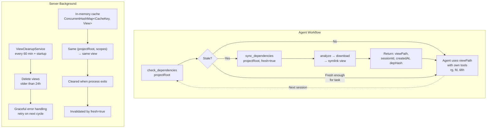

# View Lifecycle & Session Management Design

> **Status:** Decided — A1 (external view directory, no project symlink)
> **Date:** 2026-05-06

---

## Problem Statement

The `sources-mcp` server downloads dependency sources to an immutable CAS, but needs a "view" — a unified directory tree of symlinks/junctions presenting those sources to an agent. The view has a lifecycle: it's created, used, ages, and must eventually be cleaned up.

The core question: **how do we manage the lifecycle of these views, and how does the agent know when a view is stale (dependencies changed upstream)?**

---

## Core Constraint

After the view is set up, the agent searches it using its own filesystem tools (`rg`, `fd`, `tilth`). The server has no communication channel to the agent except the filesystem itself. The agent may never call back to any MCP tool. Any staleness signal must either be:
- Encoded in the filesystem (broken symlink, marker file), or
- Communicated during the explicit tool call that creates/checks the view

---

## Options Considered

### A1: External View Directory (✅ Chosen)

View is created in `cache/views/{uuid}/sources/`. The MCP tool returns the path. Agent tracks the path and passes it to its own tools.

- **Staleness:** Communicated via tool response. `check_dependencies()` is a cheap call that returns freshness without re-downloading. `sync_dependencies(fresh=true)` re-runs the pipeline.
- **Lifecycle:** Time-based pruning (24h default). No project pollution. No dangling symlinks.
- **Rejected because:** Agent must call a tool explicitly and remember the path. Extra step compared to B4.

### B1: `.dependencies/` Directly in Project Root

Symlinks created directly in `{projectRoot}/.dependencies/{ecosystem}/{namespace}/{name}/{version}`. No separate view directory.

- **Staleness:** Same problem as B4, but worse — each dependency is an individual symlink rather than a single managed directory.
- **Lifecycle:** No session management. Views accumulate until manually deleted.
- **Rejected because:** No lifecycle management at all. Path length issues on Windows. "Pollutes" project directory.

### B4: View + Project Symlink (Hybrid)

View created in `cache/views/{uuid}/sources/`, with a single symlink `{projectRoot}/.dependencies/` → view's `sources/` dir.

- **Staleness:** Agent discovers `.dependencies/` naturally but has no idea if it's stale. Requires either background monitoring to proactively break the symlink, or filesystem-encoded staleness markers. Both add infrastructure.
- **Lifecycle:** Time-based cleanup causes dangling symlink. This acts as a circuit breaker (agent discovers breakage, forced to call tool) but is error-driven rather than intention-driven.
- **Rejected because:** Staleness management requires server-side infrastructure (background dep-file hashing, symlink breaking). The ergonomic benefit of natural discovery doesn't justify the complexity when the agent needs to call the tool anyway for freshness guarantees. Effectively collapses into A1 with a symlink — the symlink just becomes a convenience that breaks when stale.

### C2: Configuration-Driven (Flexible)

Environment variable controls behavior: external view, project symlink, or both.

- **Rejected for v1:** Multiple code paths to maintain before the single path is proven. Can be added later as an evolution of A1.

---

## Decision: A1 (External View Directory)

### Why

1. **The tool call is the sync point.** Freshness is communicated when the agent asks, not engineered into a filesystem it doesn't control. The agent is always in control of freshness guarantees.

2. **Simplest lifecycle.** Time-based pruning is sufficient. No dangling symlinks to manage. No background monitoring of dependency files. No project directory pollution. No `.gitignore` management.

3. **Honest architecture.** Doesn't pretend the agent can discover freshness from the filesystem. Makes the contract explicit: if you want fresh data, call the tool.

4. **Foundation for evolution.** A1 is the minimal viable model. B4-style convenience symlinks can be added later (e.g., `sync_dependencies(projectRoot, linkIntoProject=true)`) without changing the lifecycle architecture.

### Lifecycle Model

The canonical lifecycle model is documented in the [design.md](../../openspec/changes/view-directory-management/design.md) specification. The diagram below is a simplified agent-facing view of the same workflow; for the complete model including server background components (ViewCleanupService, in-memory cache lifecycle), refer to the canonical design.md diagram.

### Key Properties

| Property | Value |
|---|---|
| View max age | 24 hours (configurable) |
| Cleanup interval | 60 minutes (configurable) |
| View keying (on disk) | UUID directory name |
| View keying (in memory) | `ViewCacheKey(normalizedProjectRoot, scopes)` |
| CAS cleanup | None by design (immutable, append-only) |
| Staleness detection | `check_dependencies()` — hashes dep declaration files vs stored hash (independent of analysis cache) |
| Freshness enforcement | `sync_dependencies(fresh=true)` → re-runs ORT analysis, reuses CAS |
| Redownload enforcement | `sync_dependencies(redownload=true)` → re-downloads sources (atomically refreshes CAS content) |

### What the Agent Must Do

- Call `check_dependencies()` before dependency searches where freshness matters
- Call `sync_dependencies()` to create or refresh views
- Track the returned `viewPath` across calls (or re-query)
- Decide freshness tolerance based on task criticality

---

## References

- [UX Rethink Summary](../research/ux-rethink-summary.md) — original brainstorming of approaches
- [UX Rethink Brainstorm](../research/ux-rethink-brainstorm.md) — full brainstorm details
- [View Directory Management (openspec)](../../openspec/changes/view-directory-management/) — detailed behavioral specs
