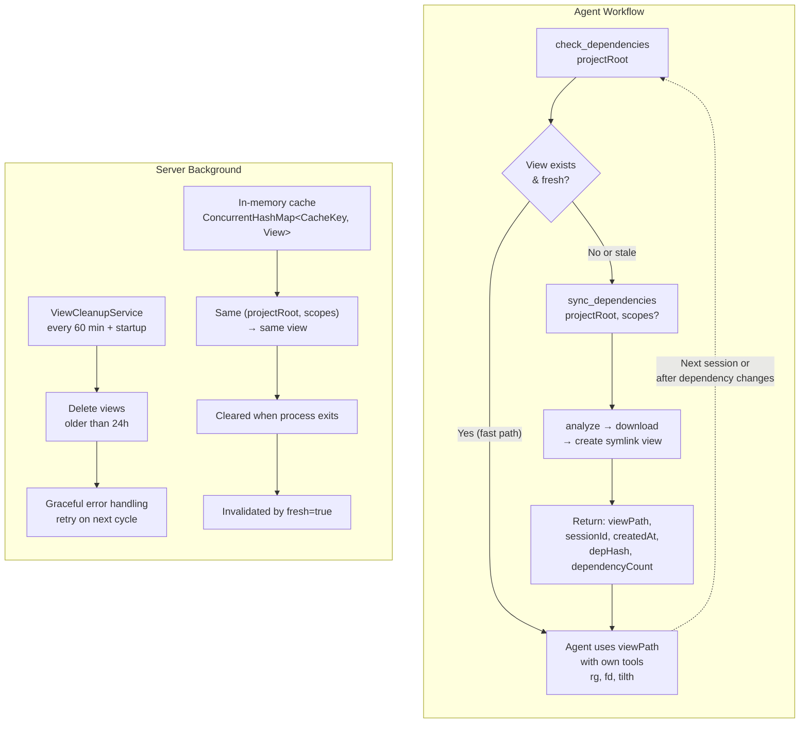

## Context

The `sources-mcp` project currently provides dependency analysis via ORT (`DependencyAnalyzer`) and source downloading to a Content-Addressable Storage (`DependencySourcesDownloader`). The CAS stores extracted sources keyed by content hash, with advisory locking for concurrency. However, there is no unified "view" directory that presents these sources in a clean, searchable tree — a capability that `gradle-mcp` already provides via session views with symlinks/junctions.

The current `SourcesMcpEnvironment` defines `cacheDir`, `analyzerCacheDir`, `casDir`, and `locksDir`, but no `viewsDir`. The `DependencySourcesDownloader` performs basic flattening (single subdirectory hoisting) but lacks the sophisticated normalization pipeline described in `NORMALIZATION.md`.

### Architecture Decision: A1 (External View Directory)

After a UX rethink ([`ux-rethink-summary.md`](../../docs/research/ux-rethink-summary.md)) and lifecycle design analysis ([`view-lifecycle-management.md`](../../docs/design/view-lifecycle-management.md)), we chose **A1**: views live externally in `cache/views/{uuid}/sources/`. No symlinks into the project directory. The MCP tool returns the path; the agent tracks it and passes it to its own tools (`rg`, `fd`, `tilth`).

The tool call **is** the sync point. Freshness is communicated when the agent asks, not engineered into a filesystem it doesn't control. This is the simplest, most honest architecture — it avoids dangling symlinks, background monitoring of dependency files, project directory pollution, and `.gitignore` management.

## Goals / Non-Goals

**Goals:**

- Provide a `SourcesViewService` with a `sync` method that orchestrates the full pipeline: analysis → download → symlink view creation, returning the view path
- Provide a `check` method for lightweight staleness detection (reads cached manifest, hashes dep files, no downloads)
- Service owns the full pipeline internally — callers do not pass pre-computed analysis results
- Support `fresh` parameter to re-do analysis while re-using CAS-stored downloads
- Support `redownload` parameter to re-use analysis but re-download+process referenced deps
- Re-use existing in-memory view if one was already created for the same project input
- Implement time-based cleanup of stale view directories
- Support Windows junctions and *nix symlinks transparently
- Implement MCP tools: `sync_dependencies` and `check_dependencies`
- Track dependency-file hashes (`depHash`) for staleness detection
- Careful locking and lock management, mitigated by ephemeral views

**Non-Goals:**

- Modifying the CAS structure or keying strategy
- Symlinking views into the project directory (B1/B4 approaches — deferred, may be added as optional convenience later)
- Real-time view updates (views are immutable after creation)
- Full KMP cross-artifact deduplication in v1 (deferred to future iteration)
- Actual source normalization (deferred out of scope — normalization service is a no-op placeholder)
- Cross-session view sharing (each `sync` call creates its own view; in-memory cache is per-process)

## Decisions

### 1. A1: External View Directory (No Project Symlink)

**Decision:** Views are created in `{cacheDir}/views/{uuid}/sources/`. The MCP tool returns the absolute `viewPath`. No symlinks are created in the project directory (no `.dependencies/`, no `.gitignore` management).

**Rationale:** The tool call is the sync point for freshness. The agent calls `sync_dependencies` or `check_dependencies` before searching dependencies, receives the path and staleness metadata, and uses its own tools on the returned path. This model avoids:
- Dangling symlinks from time-based cleanup
- Background monitoring of dependency files to proactively break symlinks
- Project directory pollution
- `.gitignore` management
- Agent confusion about staleness (no implicit assumptions about filesystem freshness)

**Alternatives considered:**
- **B4 (View + Project Symlink):** Creates `{projectRoot}/.dependencies/` → view's `sources/`. Ergonomic for natural discovery but requires staleness infrastructure (background dep-file hashing, symlink breaking). When stale, the agent discovers breakage via error, which is error-driven rather than intention-driven. Collapses into A1 with extra infrastructure.
- **B1 (`.dependencies/` directly):** Each dependency symlinked individually into project. No lifecycle management at all. Path length issues on Windows.
- **C2 (Configuration-driven):** Multiple code paths before the single path is proven. Can be added later as an evolution of A1.

### 2. Service Owns Analysis Pipeline

**Decision:** `SourcesViewService.sync(projectRoot, scopes?, fresh?, redownload?)` internally calls `DependencyAnalyzer`, `DependencyCacheService`, and `DependencySourcesDownloader`. Callers do NOT pass an `AnalyzerResult` — the service owns the entire pipeline end-to-end.

**Rationale:** With A1, the MCP tool is the single entry point. Having callers pre-compute analysis adds complexity without benefit. The service can leverage `DependencyCacheService` internally for analysis result caching, making repeated calls fast. This also simplifies the tool interface: one call, one result.

**Alternatives considered:** Accepting `analyzerResult` as a parameter (previous design) — requires callers to invoke the analyzer separately, doubling the API surface. Only makes sense if analysis and view creation are separate concerns for the caller, which they aren't in A1.

### 3. Two-Tool Model: `sync_dependencies` + `check_dependencies`

**Decision:** Two MCP tools expose the view lifecycle:

- **`sync_dependencies(projectRoot, scopes?, fresh?, redownload?)`** → `{ viewPath, sessionId, createdAt, depHash, dependencyCount, scopes }`  
  Full pipeline: analyze → download → symlink view. Returns the view path.  
  Note: Internally, `SourcesViewService.sync()` uses a `SyncMode` enum (`CACHED`, `REFRESH_ANALYSIS`, `REDOWNLOAD_SOURCES`, `FULL_REFRESH`). The MCP tools translate boolean `fresh`/`redownload` parameters into the corresponding `SyncMode`.

- **`check_dependencies(projectRoot, scopes?)`** → `{ fresh, age, depHash, currentDepHash, dependencyCount, viewExists }`  
  Lightweight: reads cached manifest if view exists, hashes dependency declaration files, compares. No downloads. Computes depHash via ORT's findManagedFiles (independent of analysis cache). Optionally accepts `scopes` for scope-aware checking.

**Rationale:** Git-like separation of "am I stale?" from "fix it." `check` is cheap and can be called freely before any dependency search. `sync` is the heavy operation, only called when needed (initial setup, staleness, or explicit refresh). The agent decides freshness tolerance based on task criticality.

**`check_dependencies` behavior:**
- If no view exists on disk → `{ viewExists: false, fresh: false }`
- If view exists and analysis cache is available → compare stored `depHash` against current dep files → `{ fresh: true/false }`

### 4. View Directory Structure

**Decision:** Use `{viewDir}/{ecosystem}/{namespace}/{name}/{version}` path structure with ecosystem prefixes always present to prevent cross-manager collisions.

**Rationale:** Consistent with `gradle-mcp` approach; ecosystem prefixes prevent collisions between packages with same name from different ecosystems (e.g., NPM `lodash` vs. a hypothetical PyPI `lodash`).

**Alternatives considered:** Omitting ecosystem prefix for single-ecosystem projects (optimization mentioned in GAP_ANALYSIS) — deferred to future iteration for simplicity.

### 5. Filesystem Strategy

**Decision:** Use symbolic links on *nix systems and junctions on Windows via `cmd /c mklink /J`.

**Rationale:** On Windows, `Files.createSymbolicLink()` creates **symbolic links** (not junctions), and symbolic links require either Administrator privileges or Developer Mode enabled. Junctions (created via `mklink /J`) do not require elevated privileges. Using `cmd /c mklink /J` for junction creation on Windows avoids the privilege requirement while maintaining cross-platform compatibility. On *nix, symbolic links via `Files.createSymbolicLink()` are the standard approach. Portability is not a concern — functional accessibility for local tools (`rg`, `tilth`) is the priority.

**Alternatives considered:** Hard links (don't work across drives, don't work for directories on Windows); copy-on-write reflinks (filesystem-specific, not universally available); `Files.createSymbolicLink()` alone (creates symbolic links, not junctions, and requires elevated privileges on Windows).

### 6. View Keying Strategy (UUID on Disk, Inputs in Memory)

**Decision:** Views are stored on disk keyed by a UUID (directory name: `{uuid}`), with an in-memory `ConcurrentHashMap` mapping project inputs to their corresponding `SessionView` reference. The cache key is a `ViewCacheKey` data class containing `normalizedProjectRoot` (as `Path`) and `scopes` (as `Set<String>`). This mirrors the `gradle-mcp` approach.

**ViewCacheKey Definition:**

```kotlin
data class ViewCacheKey(
  val normalizedProjectRoot: Path,
  val scopes: Set<String>
)
```

- **Path Normalization:** Project root paths are normalized to ensure consistent cache keys across different path representations:
  - Convert to absolute path
  - Normalize separators (`\` → `/`) for cross-platform consistency
  - Remove trailing slashes
  - Resolve symlinks for the project root (but not intermediate components)
- **Case Sensitivity:** Path comparison is case-sensitive (Paths are compared as-is); this matches typical filesystem behavior on Linux but may differ on case-insensitive filesystems like Windows — callers should normalize paths before calling the service.

**Rationale:** UUID keying on disk provides unique, collision-free directory names and enables straightforward time-based cleanup. The in-memory map by inputs enables fast lookup without scanning the filesystem, and supports the `fresh` flag for controlled invalidation. This separation of concerns (disk identity vs. logical identity) is proven in `gradle-mcp`.

### 7. View Directory Structure on Disk

**Decision:** Each view directory follows the pattern `{viewsDir}/{uuid}/` containing:
- `sources/` — symlinks/junctions to CAS entries organized as `{ecosystem}/{namespace}/{name}/{version}`
- `manifest.json` — serialized `ViewManifest` with `sessionId`, `timestamp`, `projectRoot`, `scopes`, `depHash`, and `dependencies` list

**Rationale:** UUID-only directory names provide unique, collision-free directory names without redundant timestamp information. The manifest provides self-describing metadata for recovery and debugging, and the `depHash` field enables lightweight staleness detection.

### 8. depHash for Staleness Detection

**Decision:** The view manifest stores a `depHash` — a SHA-256 hash of the dependency declaration files (e.g., `build.gradle.kts`, `settings.gradle.kts`, `gradle/libs.versions.toml` for Gradle projects). `check_dependencies` recomputes this hash and compares it against the stored value to detect staleness.

**Rationale:** Simple, deterministic staleness detection without re-running ORT analysis. The hash computation uses the same file set that ORT uses for managed files, ensuring consistency. This provides a signal for the agent to decide whether to call `sync` with `fresh=true`.

**Implementation note:** The depHash computation should use the same files identified by ORT's `findManagedFiles`, ensuring consistency between analysis caching and staleness detection.

### 9. Scope Filtering

**Decision:** When the `scopes` parameter is provided to `sync`, the service filters dependencies by scope name using exact match (case-sensitive). Multiple scopes use OR logic — a dependency is included if its scope matches ANY of the specified scopes. Unknown scope names are silently ignored.

**Rationale:** Allows agents to request only the dependencies relevant to their task (e.g., `compileClasspath` only). OR logic is more intuitive for "give me all deps in these scopes."

### 10. Mode Flag Interaction (SyncMode Enum)

**Decision:** The `SourcesViewService` uses a `SyncMode` enum internally:

| Mode | Behavior |
|------|----------|
| CACHED | Return cached view if available, otherwise create new view |
| REFRESH_ANALYSIS | Invalidate in-memory cache, re-run ORT analysis, re-use existing CAS downloads |
| REDOWNLOAD_SOURCES | Re-use cached ORT analysis, re-download sources (atomically refreshing CAS content) |
| FULL_REFRESH | Invalidate both in-memory cache AND CAS entries, re-run full pipeline fresh |

The MCP tools `sync_dependencies` accept `fresh` and `redownload` boolean parameters which map to these modes:
- `fresh=false, redownload=false` → CACHED
- `fresh=true, redownload=false` → REFRESH_ANALYSIS
- `fresh=false, redownload=true` → REDOWNLOAD_SOURCES  
- `fresh=true, redownload=true` → FULL_REFRESH

### 11. Normalization is a No-Op (Deferred)

**Decision:** Create a `NormalizationService` interface/placeholder that is currently a no-op. Actual normalization logic is deferred out of scope.

**Rationale:** The service boundary is important for future extensibility, but implementing the full normalization pipeline is out of scope for this change. The placeholder ensures the architecture is ready when normalization is needed.

**CAS vs. Normalization Relationship:** The CAS stores **raw extracted sources** as downloaded by ORT. Normalization (as described in `NORMALIZATION.md`) is a separate post-processing step. When normalization is implemented, it would either:
- Create a separate `normalized/` subdirectory within the CAS entry, or
- Create a new CAS entry keyed by the normalized content hash

In v1 of this change, symlinks point directly to CAS entry directories containing raw sources.

### 12. Locking Strategy

**Decision:** Leverage ephemeral views to minimize locking complexity. Each view creation operates on its own unique directory. CAS-level locking (already implemented via `FileLockManager`) protects concurrent downloads. View directory creation is single-writer per project key, synchronized in-memory.

**Rationale:** Ephemeral views eliminate the need for complex view-level locking. The CAS already has advisory locking for downloads. The view service only needs to ensure that concurrent `sync` calls for the same project don't create duplicate views.

**redownload Mode and Advisory Locks:** In `redownload` mode, the service acquires advisory locks on CAS entries to prevent other concurrent operations from reading the entry being refreshed. The lock is acquired, fresh sources are downloaded to a temporary directory, and atomically moved to a new CAS location (with a different content hash due to timestamp differences). Old CAS entries remain valid — they are never deleted or modified.

### 13. Cleanup Strategy

**Decision:** Time-based pruning with configurable max age (default 24 hours), triggered by a background scheduler (configurable interval, default: every 60 minutes). On MCP server startup, an initial cleanup scan is performed synchronously to remove any stale views from previous sessions. Session-end cleanup is a best-effort optimization when session tracking is available, but time-based pruning is the primary mechanism.

**Rationale:** Simple, reliable, doesn't require complex session tracking. Since views are NOT symlinked into project directories, there are no dangling symlinks to worry about — cleanup only affects the cache directory. Windows file locking issues are handled gracefully with retry-on-next-cycle.

### 14. Parallelism Strategy

**Decision:** Dependency download and symlink creation are parallelized using Kotlin coroutines with a configurable parallelism level (default: `Runtime.getRuntime().availableProcessors()`).

**Rationale:** ORT analysis is the primary bottleneck; parallelizing downloads and symlink creation reduces view creation latency. Coroutines provide structured concurrency that integrates well with the existing codebase.

**Configuration:** The parallelism level is configurable via the environment variable `SOURCES_VIEW_PARALLELISM`. If not configured, it defaults to the number of available CPU cores.

### 15. Path Length Considerations

**Decision:** The system shall document and handle Windows `MAX_PATH` (260 character) limitations gracefully.

**Rationale:** Deep dependency trees combined with UUID-keyed view directories can produce paths exceeding Windows' 260 character limit.

**Mitigation Strategies:**
- Use UUID-only directory names (the `{uuid}` format is compact and collision-free)
- Document the limitation and recommend running on paths with shorter base directories (e.g., `C:\sources\` rather than deeply nested paths)
- Log warnings when created symlinks exceed 200 characters to alert users of potential issues
- Future optimization: detect and warn about paths that would exceed MAX_PATH before creation

## Lifecycle Model



### Key Properties

| Property | Value |
|---|---|
| View max age | 24 hours (configurable via constructor) |
| Cleanup interval | 60 minutes (configurable via constructor) |
| View keying (on disk) | UUID directory name |
| View keying (in memory) | `ViewCacheKey(normalizedProjectRoot, scopes)` |
| CAS cleanup | None by design (immutable, append-only) |
| Staleness detection | `check_dependencies()` — hashes dep declaration files vs stored depHash |
| Freshness enforcement | `sync_dependencies(fresh=true)` — re-runs ORT analysis, reuses CAS |
| Redownload enforcement | `sync_dependencies(redownload=true)` — re-downloads sources to new CAS entries |

### What the Agent Must Do

- Call `check_dependencies()` before dependency searches where freshness matters
- Call `sync_dependencies()` to create or refresh views
- Track the returned `viewPath` across calls (or re-query)
- Decide freshness tolerance based on task criticality

## Risks / Trade-offs

| Risk | Mitigation |
|------|------------|
| Windows junction creation requires directory (not file) targets | Only create junctions to CAS directories (which are always directories after extraction) |
| File-in-use errors during cleanup on Windows | Graceful error handling with retry on next cycle; log warnings |
| ORT analysis is the primary bottleneck | Leverage existing `DependencyCacheService` for analyzer result caching |
| Concurrent `sync` calls for same project | In-memory synchronization per project key; ephemeral views reduce contention |
| Symlink/junction count limits on some filesystems | Unlikely to hit limits (thousands of dependencies); monitor if issues arise |
| Windows MAX_PATH (260 char) limitation | Document limitation; warn when paths exceed 200 chars; recommend short base paths |
| Agent must remember viewPath across calls | Path is always available via `check_dependencies` or re-calling `sync_dependencies` (fast path) |
| Agent may not call check before searching | Acceptable: views live 24h; agent can use stale data or call `fresh=true` when it matters |

## Migration Plan

1. Add `viewsDir` to `SourcesMcpEnvironment` (backward compatible — new directory)
2. Create `NormalizationService` as a no-op placeholder
3. Add `SourcesViewService` with `sync` and `check` methods, in-memory view cache
4. Implement symlink/junction creation logic
5. Add `ViewCleanupService` with time-based pruning and background scheduler
6. Implement MCP tools: `sync_dependencies` and `check_dependencies`
7. Add depHash computation and tracking in manifest
8. No data migration required — existing CAS entries remain valid

## Open Questions

- What is the appropriate default max age for view cleanup? (24 hours is reasonable for local development)
- Should the in-memory view cache have a size limit? (Probably not needed for local development)
- Should `check_dependencies` also validate that CAS entries still exist for the dependencies in the manifest? (Nice-to-have, but adds I/O — deferred)
- Should we support a `linkIntoProject` convenience flag later as an evolution of A1? (Yes, but not in v1)
